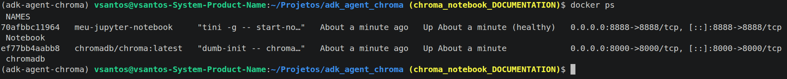
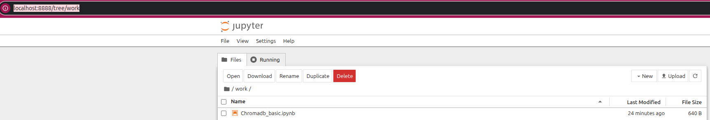

# Chroma Notebook
Entendendo um pouco como o chromadb funciona, antes de usá-lo com alguma iniciativa de IA

## Como Rodar
Vamos considerar que os passos descritos na documentação da raíz do projeto já foram executados. 

### 1. Levantando os containers
No terminal aberto em `chroma_notebook`, rode:
    
    docker compose up
ou

    docker compose up -d
Para executar em segundo plano.

Desta forma serão levantados dois containers (o container do chromadb e o container do jupyter notebook), como mostra a imagem:

### 2. Acessando o servidor jupyter
Uma vez que o servidor está em execução, vá com seu navegador até o seguinte endereço:

    http://localhost:8888/tree/work
Os notebooks devem ser criados dentro deste diretório, para que reflitam no seu local.

### 3. Crie seu notebook para usar o chromadb
A imagem do jupyter neste container já carrega instalada a biblioteca chromadb. Logo, ela pode ser importada sem problemas dentro dos notebooks que serão criados. __Lembre -se__ de sempre criar os notebooks dentro do diretório work/, pois desta forma ele será persistido no seu local. 

## Sobre o Chromadb
